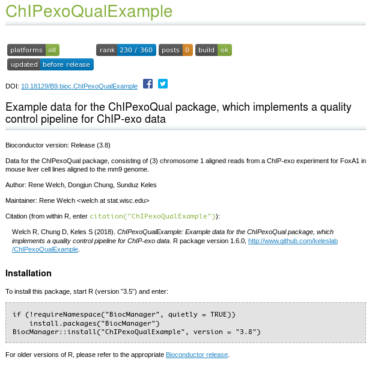
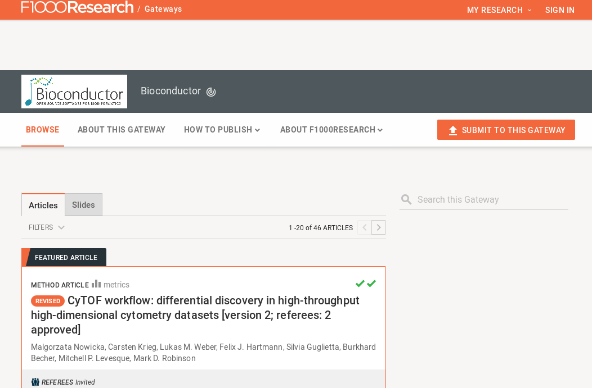

```{r setup, include=FALSE}

options(htmltools.dir.version = FALSE)

library(here)
library(rwlib)
library(tidyverse)
library(caret)
library(scales)
library(ggrepel)
library(magrittr)
library(ggthemes)

theme_set(
	theme_bw() +
	theme(
		axis.text = element_text(size = 12),
		axis.title = element_text(size = 14),
		legend.text = element_text(size =12),
		legend.title = element_text(size = 14),
		strip.text = element_text(size = 14),
		strip.background = element_blank(),
		legend.position = "top"))

knitr::opts_chunk$set(
	include = TRUE,
	echo = FALSE,
	eval = TRUE,
	warning = FALSE,
	message = FALSE,
	fig.align = "center",
	dpi = 400,
	fig.width = 4,
	fig.height = 4
	)


```

layout: false
class: bg-main1 center middle

.font5.light-green[What is Bioconductor?]

.font3[Bioconductor provides tools for the analysis and comprehension of high-throughput genomic data. Bioconductor uses the R statistical programming language, and is open source and open development. It has two releases each year, and an active user community.]

---
layout: false
class: bg-main1 middle

.center[.font5.light-green[Why Bioconductor?]]

.font2[

- .alert[Accessibility:] It is a central repository for high-throughput genomic data

- .alert[Resources:] There are many software/annotation/experiment packages that can be used

- .alert[Community:] It is very active, so there is a lot of people that can help

]


---
layout: false
class: bg-main1 middle

.center[.font5.light-green[What kind of packages?]]

.font2[

- .alert[Software:] For methods almost everything gets accepted.

- .alert[Experiment:] This is for experimental data. If the package need some example data to run, it is recommended to use one of their datasets prior to adding a new one. 

- .alert[Annotation:] Annotation packages contain lightly or non-curated data from a public source and are updated with each .alert[Bioconductor] release (every 6 months). They are a source of general annotation for one or many organisms and are not specific to a particular experiment. When possible, they should support the `select()` interface from `AnnotationDbi`.

]


---
layuot: false
class: bg-main1 middle center

.font5.light-green[Experiment packages]

.font3[Typical stuff: Some data for the vignette]

```{r experiment_example_chipexo,echo=FALSE,out.width="650px"}



```

---
layuot: false
class: bg-main1 middle center

.font5.light-green[Experiment packages]

.font3[or a package with plotting functions]

```{r experiment_example_ihw,echo=FALSE,out.width="650px"}

knitr::include_url("http://bioconductor.org/packages/release/data/experiment/html/IHWpaper.html")

```

<!-- --- -->
<!-- layout: false -->
<!-- class: bg-main1 middle center -->

<!-- .font5.light-green[Software packages] -->


---
layou: false
class: bg-main1 middle

.center[.font5.light-green[Software packages]

.font3.alert[ General guidelines]]


---
layout: false
class: bg-main1 middle center

.font5.light-green[F1000Research Channel]


```{r f1000,include=TRUE,echo=FALSE,out.width="650px"}



```


---
layout: false
class: bg-main1 middle

.center[.font5.light-green[Resources]]

.font2[

- Ramos et al., [_"Software for the Integration of Multiomics Experiments in Bioconductor"_"](http://cancerres.aacrjournals.org/content/77/21/e39), Cancer Research 2017

- Pasolli et al., [_"Accessible, curated metagenomic data through ExperimentHub"_](https://www.nature.com/articles/nmeth.4468), Nature Methods 2017

- Huber et al., [_"Orchestrating high-throughput genomic analysis with Bioconductor"_](https://www.nature.com/articles/nmeth.3252), Nature Methods 2015

- Lawrence et al., [_"Software for Computing and Annotating Genomic Ranges"_](https://journals.plos.org/ploscompbiol/article?id=10.1371/journal.pcbi.1003118), PLOS Comp Bio 2013

]


